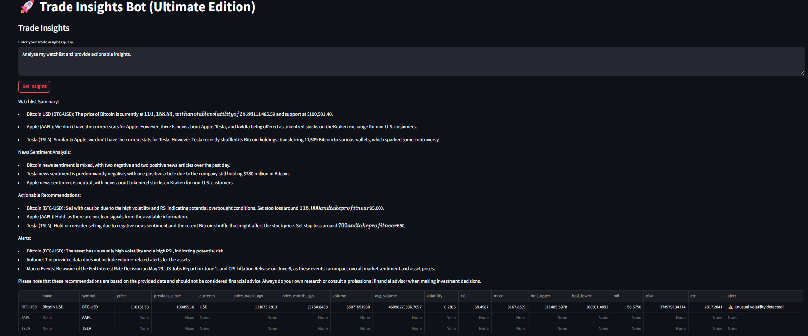

# 🚀 Trade Insights Bot (Ultimate Edition)

A multi-agent AI-powered trading assistant that delivers **real-time insights**, **portfolio analytics**, **news sentiment**, **strategy backtesting**, and **market intelligence** using Streamlit + FastAPI + LLMs + Quant Libraries.

  

---

## ✨ Features

- 📈 **Trade Insights**: Get technical + statistical analysis with actionable advice.
- 📰 **News Sentiment Analysis**: Understand real-world sentiment using DuckDuckGo News.
- 💼 **Portfolio Analytics**: Sharpe Ratio, Volatility, Drawdown & Risk Level.
- 🔬 **Strategy Backtesting**: LLM-powered summary of trading strategies.
- 🔁 **Compare Strategies**: Evaluate multiple strategies side-by-side.
- 📊 **Sentiment History Visualization**.
- 🧠 **LLM Integration**: Uses `Together.xyz` Mixtral-8x7B for advanced reasoning.
- 🔧 **Feedback API** for users to rate insights and improve performance.

---

## 🖥️ Architecture

```

\[Streamlit UI] ⟷ \[FastAPI Backend] ⟷ \[Together LLM API]
⟷ yFinance + TA-Lib + QuantStats + ffn
⟷ DuckDuckGo Search

````

---

## 🛠️ Tech Stack

- **Frontend**: Streamlit
- **Backend**: FastAPI + httpx
- **Finance Libraries**: yFinance, TA-Lib, QuantStats, ffn
- **LLM**: Mixtral-8x7B-Instruct via Together API
- **News**: DuckDuckGo Search (`duckduckgo_search`)

---

## 🚀 Run Locally

### 1. Clone the repo

```bash
git clone https://github.com/your-username/trade-insights-bot.git
cd trade-insights-bot
````

### 2. Install dependencies

```bash
pip install -r requirements.txt
```

### 3. Run the FastAPI backend

```bash
uvicorn trade_insights_bot:app --reload --port 8000
```

### 4. Launch Streamlit GUI

```bash
streamlit run trade_insights_gui.py
```

> ⚠️ Ensure your backend is running at `http://localhost:8000` for full functionality.

---

## 📸 Screenshots

| Trade Insights                      | Portfolio Analysis                 | Strategy Backtesting             |
| ----------------------------------- | ---------------------------------- | -------------------------------- |
|  |  |  |

---

## 👥 Team

* **Madhav** 
* **Kodali Viswanath** 
* **Sanjit Teja** 

> Special thanks to all collaborators and open-source libraries that made this project possible.

---

## 📬 Feedback

We value your feedback! Use the built-in form in the app to submit ratings, comments, and improvement suggestions.

---

## 📄 License

MIT License - feel free to use and modify.

---

## 🌐 Coming Soon

* Real-time trading signal integration
* Custom strategy builder with backtest visualizations
* Enhanced financial news clustering and risk flagging
